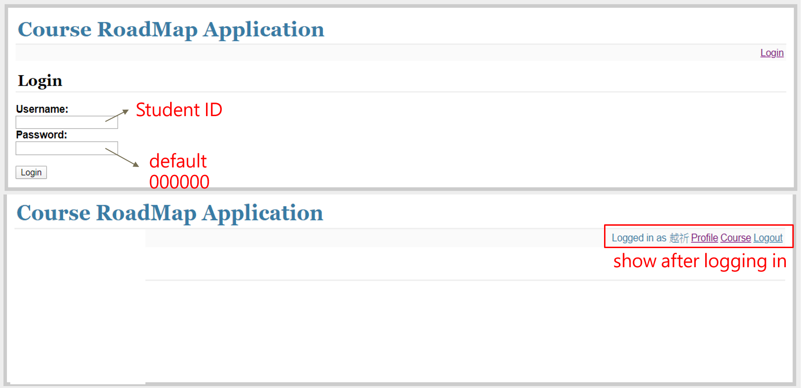

# Graph Database Implementation (Online part only)
## Introduction
Questions
* Too many similar courses on the internet, how can we help a junior student to choose right courses?
* Before choosing courses, can we know the prerquisites relationship of the course that is going to be enrolled? And how can we show that to users?
* Can we provide an interactive interface for students attending the same courses?

Goal
* Implement a learning platform to integrate online/offline resource and offer the complete learning map for CS students.

## System Design (Pre-processing and online)

## Data Structure

## Online
### Functionality (Online)
* Basic User Functions
  * User login system
  
  * Course taken
    * Use py2neo to sent query to neo4j then use Flask to show the data from neo4j on website
    
  * Course involvement
    * List every students who taken the same course with you. This is part of social engagement feature.
    
* Query Functions
  * Course search
    * Search courses by
      1. Course name
      2. Professor
      3. School
      
    * After enter the condition, the system will send the query to neo4j to retrieve the corresponding data
  * Course relationship (pre-requisite, required)
    * Show the relationship between courses.  
      Relationship have been built in database, by querying we can retrieve the below result.
      
      
* User Personal Function (CRUD)
  * Course modification
    * We offer some function for user to change their course history, including add, delete, and modify
    
* More Functions
  * Course recommendation
    * According to user's history course record, we will suggest some courses to user.  
      On the basis of required courses and suggest courses, make user learn more efficiency, and avoid them from learning on the wrong road.  
      
  * Course History Visualization
    * According to user's history course record, we attempt to let user check what courses they took before conviniently.  
      Visualize the history course can make it very helpful.  
      
## Contribution
* Data Collection
  * Raw Data
    * Courses
    * Professors
    * Students(history)
  * Relationship Data
    * Course relationship
* System Development
  * Flask
    * Connect website and database server
    * Website GUI
    * Database visualization function
  * py2neo
    * Website function development
